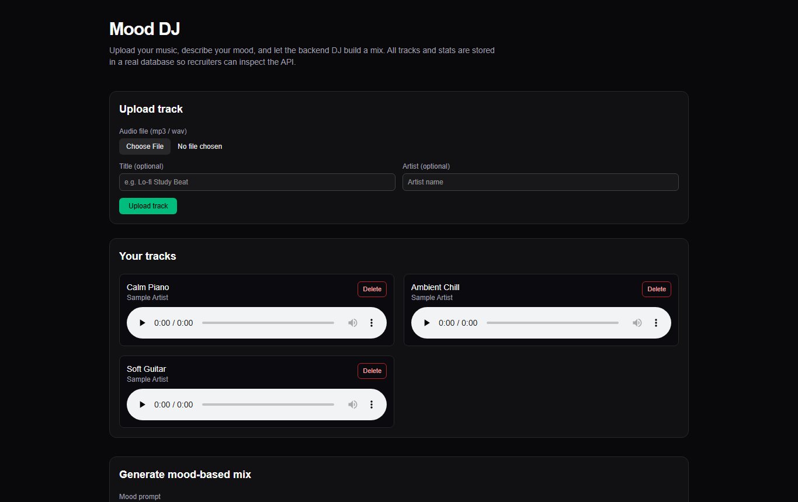

# Mood DJ – AI-Powered Music-Based Mood Mixer 🎧

Mood DJ is a **full-stack Next.js application** that lets users:

- Upload their own music files (`.mp3`, `.wav`)
- Enter a **mood prompt** (e.g. _“romantic evening”_, _“calm focus”_)
- Generate an **AI-powered playlist/mix** based on that mood
- Play tracks directly in the browser
- See **Top Tracks** computed via **DB aggregation + caching**




## 🚀 Tech Stack

**Frontend**

- Next.js 16 (App Router, TypeScript)
- React with client-side playback UI (`<audio>` element)

**Backend**

- Next.js API Route Handlers (`app/api/**`)
- Prisma ORM
- PostgreSQL (Neon)
- In-memory TTL cache for stats (`topTracksCache.ts`)
- OpenAI API (LLM) for mood-based mix generation, with safe fallback logic

---

## 🎯 Features vs Requirements

### ✅ Core Requirements Mapping

- **Upload music files**
  - Endpoint: `POST /api/tracks`
  - Accepts `multipart/form-data` with an audio file (`mp3/wav`) + metadata
  - Saves file to `uploads/` directory (local dev) and metadata to **PostgreSQL** via Prisma.

- **List tracks**
  - Endpoint: `GET /api/tracks`
  - Returns all stored tracks from DB sorted by `uploadedAt DESC`.

- **Mood prompt → AI-backed mix**
  - UI input for mood (e.g. _“calm focus”_, _“party night”_).
  - Endpoint: `POST /api/mix`
  - Backend sends **available tracks + mood** to an **LLM (OpenAI)**.
  - LLM responds with a list of selected track IDs + order/weight.
  - Backend returns a **playable ordered mix** to the frontend.
  - If LLM fails or quota is exceeded, a **local heuristic** generates a mix (still stores usage counts etc).

- **Save generated mix**
  - Mixes are represented by:
    - `Mix` – the generated mix (mood, createdAt)
    - `PlaylistTrack` – join table between `Mix` and `Track` with `order` field.
  - `/api/mix` creates `Mix` + `PlaylistTrack` rows when a mix is generated successfully.

- **Track usage stats**
  - Each time a track is selected into a mix, a `PlaylistTrack` row is created.
  - **Aggregation query** counts how many times each track appears across all mixes.

- **Top tracks endpoint with caching**
  - Endpoint: `GET /api/stats/top-tracks`
  - Prisma aggregation + ordering by selection count.
  - Results are cached using an in-memory **TTL cache**:
    - File: `src/lib/topTracksCache.ts`
    - Avoids repeated heavy aggregation calls.
    - Cache invalidation happens when a new mix is generated.

- **Simple UI**
  - Upload & play music:
    - Upload section supports selecting a local file and sending via API.
    - Track list with title/artist and **Play** / **Delete** buttons.
  - Mood prompt box:
    - Input mood text → `Generate Mix` button.
    - Shows a generated ordered playlist and allows playback.
  - Top Tracks:
    - Sidebar/section that calls `/api/stats/top-tracks` and displays most-used tracks.

---

## 🧱 System Design & Architecture

### High-Level Flow

1. **Upload**
   - User selects an audio file and metadata (title, artist).
   - Frontend sends `POST /api/tracks` with `FormData`.
   - Backend:
     - Saves file into `uploads/` folder.
     - Computes a local `fileUrl` like `/api/audio/<filename>`.
     - Inserts a `Track` row in PostgreSQL.

2. **Playback**
   - UI calls `GET /api/tracks` to render the track list.
   - When user clicks **Play**, browser loads audio from:
     - `GET /api/audio/[filename]`
   - Route handler streams the file from the `uploads/` directory.

3. **Generate Mood Mix**
   - User enters a mood prompt and clicks **Generate Mix**.
   - Frontend sends `POST /api/mix` with JSON `{ mood: "romantic evening" }`.
   - Backend:
     - Loads all tracks from DB (`prisma.track.findMany`).
     - Calls **OpenAI** with `(mood + track list as context)` via `src/lib/llm.ts`.
     - If LLM responds successfully:
       - Map LLM-selected IDs to actual tracks.
       - Create `Playlist` and `PlaylistTrack` entries.
     - If LLM fails/quota exceeded:
       - Log error.
       - Use heuristic selection:
         - Sort recent tracks.
         - Take the 3–6 most recently uploaded tracks.
       - Still create DB entries so **stats remain correct**.
     - Returns an ordered list of tracks to the frontend.

4. **Top Tracks**
   - `/api/stats/top-tracks` runs a Prisma aggregation over `PlaylistTrack`.
   - Wraps the result into a TTL cache (e.g. 30s–60s).
   - Later requests within TTL return cached data.

---

## 🗄️ Data Model (Prisma Schema)

Core entities (simplified):

```prisma
model Track {
  id          Int              @id @default(autoincrement())
  title       String
  artist      String?
  fileUrl     String
  durationSec Int?
  uploadedAt  DateTime         @default(now())
  mixes       PlaylistTrack[]
}

model Mix {
  id          Int              @id @default(autoincrement())
  moodPrompt  String
  createdAt   DateTime         @default(now())
  tracks      PlaylistTrack[]
}

model PlaylistTrack {
  id        Int   @id @default(autoincrement())
  mix       Mix   @relation(fields: [mixId], references: [id])
  mixId     Int
  track     Track @relation(fields: [trackId], references: [id])
  trackId   Int
  order     Int
  weight    Float
}
```

---

## 🚀 Getting started

**Prerequisites:** Node.js 20+ and a PostgreSQL database (a free [Neon](https://neon.tech) database works).

```bash
npm install
cp .env.example .env          # set DATABASE_URL; OPENAI_API_KEY is optional
npx prisma db push            # create the Track, Mix and PlaylistTrack tables
npm run dev                   # http://localhost:3000
```

Without `OPENAI_API_KEY`, mixes use the fallback (the most recent 3–6 tracks).

**Demo data:** `POST /api/dev/seed-tracks` adds three royalty-free samples hosted by samplelib.com:

```bash
curl -X POST http://localhost:3000/api/dev/seed-tracks
```

## 🎵 Audio files

Uploads are saved to `uploads/`, which is git-ignored. Use music you own or have the rights to share.

## ⚠️ Known limitations

- Uploaded files are written to local disk, which does not persist on serverless hosts such as Vercel or Netlify; production use needs object storage (for example S3 or R2).
- No authentication; the `/api/dev/seed-tracks` route is open.

## 📄 License

MIT. See [LICENSE](LICENSE).
